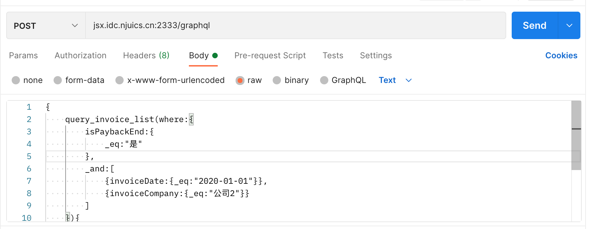

### 操作说明

+ postman api example

    url: `POST` jsx.idc.njuics.cn:2333/graphql

  

+ 所有的类型：

    Saler

    Cash
    
    Invoice

    Deposit

    GrossProfit

    CompanyExpense

    Margin

    CashSalary

    AdministrativeCost

    Payback

+ 规范 以Invoice为例

  +     
        //创建一个invoice，关联一个saler对象
        {
            create_invoice(data:{
                invoiceId:"3",
                saler:"619c88226a1a336c5bed52f7",//输入saler的_id
                invoiceDate:"2022-11-12",
                isPaybackEnd: "是",
                arriveDate:"2020-01-01",
                invoiceCompany:"公司3"
            }){
                 _id  //主键
                invoiceDate  
            }
        }

  + 
        //根据_id查询invoice，并且关联saler的查询
        {
            query_invoice(_id:"619c89226a1a336c5bed52fa"){
                saler{
                    name
                }
                invoiceDate
            }
        }

  + 
        //查询invoice列表
        {
            query_invoice_list{
                saler{
        	    name
                }
                invoiceDate
            }
        }
    
  + support [ _and , _or , _eq , _neq , _gt , _lt ] for field with `String`,`Int`  type in query_xx_list
    
    for example:
    

        //单个筛选条件
        {
            query_invoice_list(where:{
                isPaybackEnd:{
                    _eq:"是"
                }
            }){
                _id
                isPaybackEnd
                invoiceDate
                invoiceCompany
            }
        }

        //_and
        {
            query_invoice_list(where:{
                _and:[
                    {invoiceDate:{_eq:"2020-01-01"}},
                    {invoiceCompany:{_eq:"公司2"}}
                ]
            }){
                _id
                isPaybackEnd
                invoiceDate
                invoiceCompany
            }
        }
    
        //_or
        {
            query_invoice_list(where:{
                _or:[
                    {invoiceDate:{_eq:"2020-01-01"}},
                    {invoiceCompany:{_eq:"公司2"}}
                ]
            }){
                _id
                isPaybackEnd
                invoiceDate
                invoiceCompany
            }
        }

        {
            query_customerExpense_list(where:{
                amount:{_neq:1214},
                _and:[
                    {customerExpenseId:{_eq:"1"}},
                    {date:{_eq:"2020-01-01"}}
                ]
            }){
                _id
                amount
            }
        }
        
  + custom defined api for example

    definition like:

        {
          create_api(
            nodeType:"Saler",
            apiName:"getSalerNum",
            code:"System.out.println(\"nodeType:\" + coreNodeType);JSONObject jsonObject = new JSONObject();jsonObject.put(\"name\",\"tc\");return jsonObject;"
          )
        }

    api use like:

        {
            getSalerNum{
                name
            }
        }